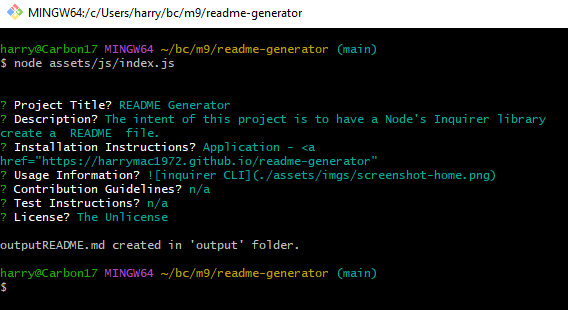

# README Generator

## Description

The intent of this project is to have a Node's Inquirer library create a README file.

It also demonstrated the mechanism of importing other javascript files.  These then can employ variables or methods from it.  Effectively creating one's own library or module.

I learned from this project the ease of importing necessary data into one script from a JSON type dictionary structure in another.  ie: the importing of Objects.

## Installation   

Application - <a href="https://harrymac1972.github.io/readme-generator/" style="font-weight:bolder;">README.md Generator</a>
Repository Location - <code><strong>https://github.com/harrymac1972/readme-generator</strong></code>
Git Bash - <code><strong>git clone git@github.com:harrymac1972/readme-generator.git</strong></code> once in your folder of choice

Inside your Bash CLI run 'node/assets/js/index.js' to begin the Inquirer's questions.
Answer all prompts truthfully for best results!

## Usage

## Credits

Resources:

    https://www.npmjs.com/package/inquirer
    https://hashnode.com/post/getting-user-input-in-nodejs-using-inquirerjs-ckynrlihg05k7fms1b8677f5r
    